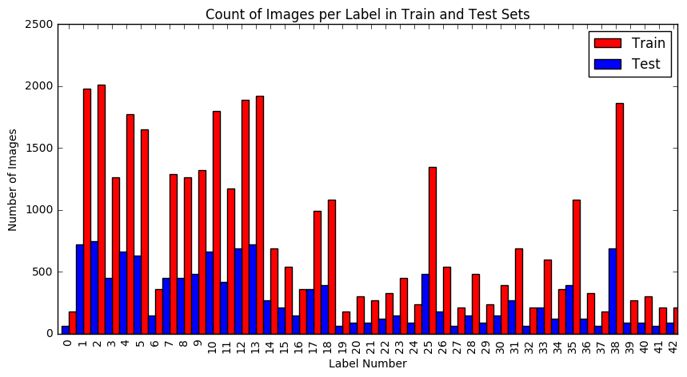

#**Traffic Sign Recognition** 

##**Introduction**

The goal this project were to create a model to accurately classify images of German traffic signs. In order to accomplish this goal, the following tasks were performed:

- Load, summarize, and explore the image data set used for the analysis.
- Design, train, validate and test a model architecture that was capable of accurately classifying the data.
- Use the model to make predictions on a new set of images downloaded separately from the internet.
- Analyze the confidence of the predictions on this new data set.

A summary of the work done for each of these tasks along with a discussion of the results obtained is contained in the sections that follow. Throughout these sections references to a corresponding Jupyter notebook will be made. This notebook (CarND-Traffic-Sign-Classifier-Project.ipynb) can be found withing the same GitHub repository that contained this writeup.

###Data Set Summary & Exploration

####1. Summary of the data set

The data set used for this analysis was derived from the data made available at the [INI Benchmark Website](http://benchmark.ini.rub.de/?section=gtsrb&subsection=dataset). This was a set of images obtained from actual video obtained while driving on German streets. There are 43 different types of signs contained within roughly 50,000 images. For convenience, pickled versions of this source data set, that partitioned the data into training, validation, and test sets were provided. These pickled data sets also transformed each image into a 32x32 pixel RGB format. From these data sets some basic statisitics were retrieved in order to get a better understanding of the data contents. This analysis can be found in the Jupyter notebook in analysis cells under the heading ' Step 1: Dataset Summary & Exploration' and sub-heading 'Provide a Basic Summary of the Data Set Using Python, Numpy and/or Pandas'

This analysis revealed the following characteristics of the data set

* The size of training set was 34799.
* The size of validation set was 4410.
* The size of test set is 12630.
* The shape of a traffic sign image is (32, 32, 3) - (Height, Width, Channels).
* There were 43 unique classes/labels in the data set.

####2. Exploratory visualization of the dataset.

Beyond the basic data set characteristics given above, we went one step further to get an understanding of how the images were distributed across the classification labels. Knowing this information could inform the design of the model in subsequent steps. This analysis can be found in the Jupyter notebook in analysis cells under the heading ' Step 1: Dataset Summary & Exploration' and sub-heading 'Include an exploratory visualization of the dataset'

The bar chart given below shows that certain labels defintely appear more frequently than others within the data set. We can also make a subjective conclusion that both the training and test data sets have similar distributions of the labels. Therefore, we can conclude that a model derived from the training set should perform somewhat similarly on the test set.

Figure 1. Count of Images per Label in Train and Test Sets

###Model Architecture - Design and Test

####1. Image Pre-Processing

Image pre-processing was performed in order to improve model performance. As such, the pre-processing steps were performed iteratively, with additional steps added until acceptable model performance was achieved.

First, images were converted from RGB to grayscale. This was done to simplify the input to model, which would reduce the number of model parameters required and also minimize slight color differences for images of the same label. 

Second, grayscale values were normalized between 0 and 1. This was done in order to help optimizer performance by minimizing the spread in greyscale values across images.

Finally, normalized values were then centered on the mean. This was again done to condition the input as much as possible to help minimize the amount of work the optimizer needed to do.

The code for this step is contained in the Jupyter notebook in analysis cells under the heading ' Step 2: Design and Test a Model Architecture' and sub-heading 'Pre-process the Data Set'. A 'pre-process' function was written and used to pre-process the training, validation, test, and new data sets before passing them to the model for classification.

####2. Training, Validation, and Test Data Sets

As mentioned above training, validation, and test data sets were provided. Therefore, there was not a significant amount of work to be done for this step. The setup for each data set is contained in the Jupyter notebook under the heading 'Step 0: Load The Data'

My final training set had 34799 number of images. My validation set and test set had 4410 and 12630 number of images, respectively.

I chose not to augment the dataset with manufactured or "fake" data as I don't particurlarly see the value in doing this. Data generated from existing data, theoretically, adds no new information to the model. Also, if one is not careful, it would seem to be possible to adversely affect the distribution of labels if manufactured data were introduced.

####3. Description of the final model architecture

The code for this step is contained in the Jupyter notebook in analysis cells under the heading ' Step 2: Design and Test a Model Architecture' and sub-heading 'Pre-process the Data Set'

My final model was heavily influenced by the LenNet architecture and consisted of the following layers:

Table 1. Model Architecture

| Layer         		|     Description	        					|
|:---------------------:|:---------------------------------------------:|
| Input         		| 32x32x1 Grayscale image   					|
| Convolution 5x5     	| 1x1 stride, valid padding, outputs 28x28x6 	|
| RELU					|												|
| Max pooling	      	| 2x2 stride,  outputs 14x14x6 			     	|
| Convolution 5x5	    | 1x1 stride, valid padding, outputs 10x10x16   |
| RELU					|												|
| Max pooling	      	| 2x2 stride,  outputs 5x5x16 			     	|
| Flatten       		| outputs 400        							|
| Fully connected		| outputs 120                                   |
| RELU					|		       					       			|
| Fully connected		| outputs 84        							|
| RELU					|		       					       			|
| Dropout				|		       					       			|
| Fully connected		| outputs 43        							|
| Softmax				|              									|

As mentioned, this is very similar to the LetNet architecture with the addition of a dropout layer before the final output layer. This was added to help minimize overfitting of the training set.

####4. Model Training.

The code for training the model is located in the Jupyter notebook in analysis cells under the heading ' Step 2: Design and Test a Model Architecture' and sub-heading 'Train, Validate and Test the Model'

To train the model, I used the AdamOptimizer to minimize the softmax cross entropy of the model output. The Adam optimizer was chosen in hopes that it's features that provide 'momentum' would allow it find a solution while being less likely to get caught in a local minimum than the standard GradientDescentOptimizer. From there the number of epochs, batch size, and learning rate were chosen iteratively and the final values represent those values that allowed the model to achieve the best accuracy performance in the minimum number of epochs. To summarize, the final model training parameters chosen are given in table 2.

Table 2. Final model training parameters

| Parameter         	|     Final Value    |
|:---------------------:|:------------------:|
| Epochs         		| 15  			     |
| Batch Size          	| 64 	             |
| Learning Rate			| 0.0025			 |

####5. Model Development.

The code for training the model is located in the Jupyter notebook in analysis cells under the heading ' Step 2: Design and Test a Model Architecture' and sub-heading 'Train, Validate and Test the Model'. Accuracy calculations occur, specifically in the last two cells of this section.

My final model results were:

* training set accuracy of 0.98
* validation set accuracy of 0.94
* test set accuracy of 0.92

As mentioned above, the LeNet model was chosen as the initial input for the model. This was chosen due to its convolutional nature. Given that we would be trying to classify common traffic signs in multiple images, where the same basic features, such as edges, shapes, groupings of shapes, of each sign may appear slightly differently in the images, a convolutional approach seemed appropriate. A test run was performed with the base LeNet architecture, and this run showed sub-standard accuracy performance on the validation set and also indicated some level of over-fitting as the validation set accuracy was several points lower than the test set. From here, basic changes to image pre-processing were applied, which improved validation accuracy somewhat, but did not remedy the over-fitting issue. To address the over-fitting issue several things were tried, including, changing the total number of layers, adjusting the output size of each layer, and adding a dropout layer between the fully-connected layers. The addition of the dropout layer improve produced the greatest reduction in the overfitting issue so it was chosen for the final architecture. The location of the dropout within the fully connected layers had minimal impact, but locating it before the final output layer seemed to make the most intuitive sense so that is where it was located in the final architecture. The final keep probability was aggressively chosen, but proved to produce the best accuracy. With all that said, despite sufficient performance on the validation set, the over-fitting was never completely removed. I believe that instead of trying to address this with the model architecture, splitting up the training set into several cross-validation sets might have helped reduce over-fitting.

###Test a Model on New Images

####1. Choose five German traffic signs found on the web and provide them in the report. For each image, discuss what quality or qualities might be difficult to classify.

Here are five German traffic signs that I found on the web:

![alt text][image4] ![alt text][image5] ![alt text][image6] 
![alt text][image7] ![alt text][image8]

The first image might be difficult to classify because ...

####2. Discuss the model's predictions on these new traffic signs and compare the results to predicting on the test set. Identify where in your code predictions were made. At a minimum, discuss what the predictions were, the accuracy on these new predictions, and compare the accuracy to the accuracy on the test set (OPTIONAL: Discuss the results in more detail as described in the "Stand Out Suggestions" part of the rubric).

The code for making predictions on my final model is located in the tenth cell of the Ipython notebook.

Here are the results of the prediction:

| Image			        |     Prediction	        					| 
|:---------------------:|:---------------------------------------------:| 
| Stop Sign      		| Stop sign   									| 
| U-turn     			| U-turn 										|
| Yield					| Yield											|
| 100 km/h	      		| Bumpy Road					 				|
| Slippery Road			| Slippery Road      							|

The model was able to correctly guess 4 of the 5 traffic signs, which gives an accuracy of 80%. This compares favorably to the accuracy on the test set of ...

####3. Describe how certain the model is when predicting on each of the five new images by looking at the softmax probabilities for each prediction and identify where in your code softmax probabilities were outputted. Provide the top 5 softmax probabilities for each image along with the sign type of each probability. (OPTIONAL: as described in the "Stand Out Suggestions" part of the rubric, visualizations can also be provided such as bar charts)

The code for making predictions on my final model is located in the 11th cell of the Ipython notebook.

For the first image, the model is relatively sure that this is a stop sign (probability of 0.6), and the image does contain a stop sign. The top five soft max probabilities were

| Probability         	|     Prediction	        					| 
|:---------------------:|:---------------------------------------------:| 
| .60         			| Stop sign   									| 
| .20     				| U-turn 										|
| .05					| Yield											|
| .04	      			| Bumpy Road					 				|
| .01				    | Slippery Road      							|

For the second image ... 